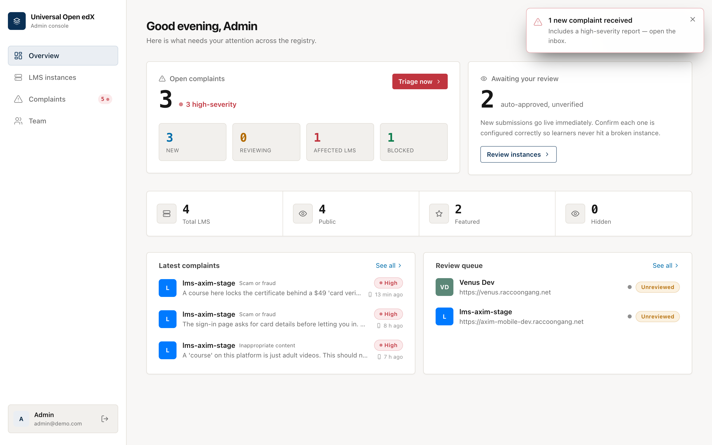
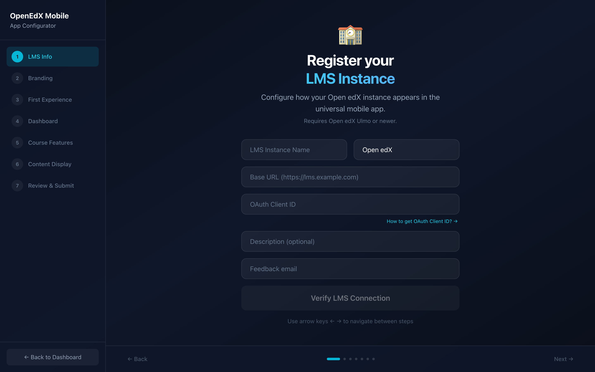
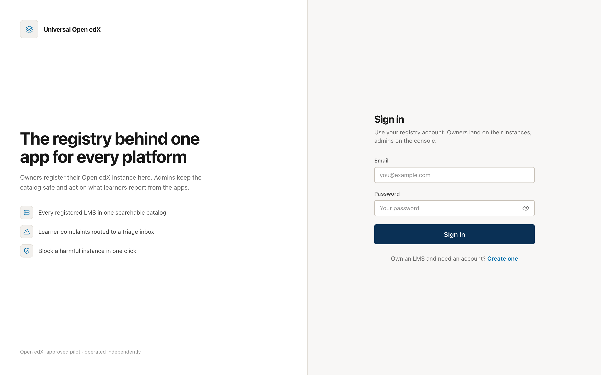
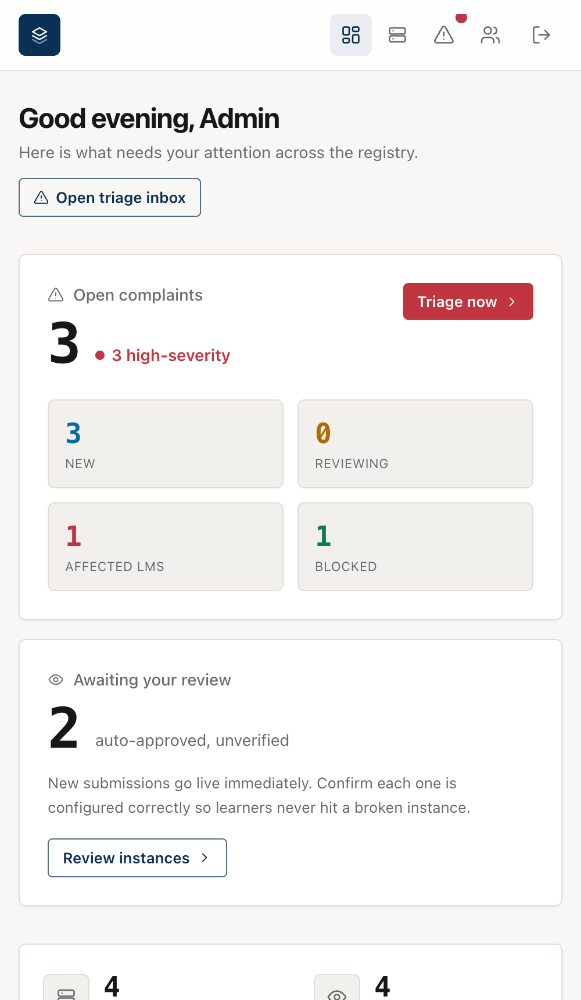

# Open X Project — LMS Registry

One mobile app that works with any Open edX platform. This service is the
registry behind it: LMS owners register their instance, it shows up in the
mobile app's catalog, and administrators keep an eye on quality and act on
learner complaints.

> **Pilot status.** Open edX has approved this pilot. It runs independently and
> not under the Open edX name. If the pilot goes well, Open edX will decide
> whether to run it officially. The iOS and Android branches referenced below
> will move to the official Open edX repositories at that point.

Live instance: **https://openedx-lms.stepanok.com**

---

## How it works

```
  LMS owner                Registry (this repo)              Learner (mobile app)
 ┌──────────┐   register   ┌───────────────────┐   catalog   ┌──────────────────┐
 │  Wizard  │─────────────▶│  auto-approved     │◀───────────│  search / browse │
 └──────────┘              │  + admin review    │            │  pick an LMS     │
                           │                    │            │                  │
       admins ◀── triage ──│  complaints inbox  │◀── report ─│  "report a       │
       recheck health      │  + webhook alert   │            │   problem"       │
                           └───────────────────┘            └──────────────────┘
```

1. An owner opens the **wizard**, enters their LMS URL and OAuth client, and the
   registry verifies the connection live.
2. The submission is **auto-approved** so it appears in the catalog right away.
   It stays flagged as *unreviewed* until an admin confirms it.
3. Learners open the mobile app, **find their platform** in the catalog, and
   sign in. The app themes itself from the registry (accent color, logo, feature
   flags).
4. If something's wrong, the learner opens the app's **Profile** tab and taps
   **Report this LMS**. The complaint lands in the admin **triage inbox** within
   seconds, and an outgoing webhook pings whatever channel the team watches.
5. An admin opens the platform to check it, then **blocks** it (removed from the
   app) or **dismisses** the report, and can email the owner the reason. Blocking
   is always a human decision — complaints never take a platform down on their own.

## Screens

**Admin console — overview**


**Complaints triage inbox** (high severity first, with the reporter's screenshot inline)


**A complaint arriving live** (badge + toast the moment a high-severity report lands)


**LMS instances** (search, filters, health, catalog placement)


**Registration wizard** (owners register and theme their platform)


<details>
<summary>More screens</summary>

**Sign in**


**Team** (administrators and LMS owners)


**Responsive** (the console on a phone)


</details>

## What's inside

| Area | What it does |
|------|--------------|
| **Registration wizard** (`wizard/`) | Guided flow to register and theme an LMS; validates the URL + OAuth client against the live server |
| **Admin console** (`admin/`) | Overview, LMS management at scale (search / filter / paginate), the complaints inbox, and team management |
| **Backend** (`app/`) | FastAPI + SQLite. Auth, catalog API, complaint intake, webhook delivery, health re-checks |
| **Mobile** | iOS and Android apps consume `/api/v1/*` to browse the catalog, apply per-LMS config, and report problems |

## Run it locally

Requirements: Python 3.12 and Node 18+.

```bash
# 1. Backend (creates ./data, seeds demo data on first run)
python3.12 -m venv .venv && . .venv/bin/activate
pip install -r requirements.txt
python run.py                     # serves on http://localhost:8000

# 2. Build the web apps (output lands in app/static/, which the server serves)
cd wizard && npm install && npm run build && cd ..
cd admin  && npm install && npm run build && cd ..
```

Then open:
- `http://localhost:8000/dashboard` — admin console
- `http://localhost:8000/wizard/` — registration wizard
- `http://localhost:8000/docs` — API docs

Demo logins: `admin@demo.com` / `admin123` (admin), `user@demo.com` / `user123`
(owner).

## Configuration

Set these as environment variables, or drop a `provider_config.json` at the repo
root (env wins over file). Everything has a working default.

| Key | Default | Meaning |
|-----|---------|---------|
| `DIRECTORY_MODE` | `search` | `search` = public catalog; `curated` = provider mode |
| `PROVIDER_NAME` | `Open X Project` | Brand shown on the app landing + console |
| `PROVIDER_TAGLINE` | … | One-liner under the brand |
| `AUTO_APPROVE` | `true` | New submissions go live immediately |
| `WEBHOOK_URL` | – | POST target for each new complaint |
| `WEBHOOK_SECRET` | – | Sent as `X-Webhook-Secret` if set |

Example `provider_config.json`:

```json
{
  "directory_mode": "curated",
  "provider_name": "Acme Learning",
  "provider_tagline": "All of Acme's academies in one app",
  "webhook_url": "https://hooks.slack.com/services/…"
}
```

## Running one app for several of your own LMS (provider mode)

Some providers run more than one Open edX platform and want a single branded app
that lists all of them, with no search step. That is what `curated` mode is for.

1. **Fork this repository** and deploy your own registry.
2. Set `DIRECTORY_MODE=curated` and your `PROVIDER_NAME` / `PROVIDER_TAGLINE`.
3. Register each of your platforms through the wizard, then in the console open
   **LMS instances** and toggle the **star** to feature each one. `sort_order`
   controls the order they appear in.
4. Point your mobile builds at your registry:
   - iOS: `LMS_DIRECTORY_URL` in `rg-feature-flags.yaml`
   - Android: `LMS_DIRECTORY_URL` (and optionally `DIRECTORY_MODE`) in
     `core/assets/config/rg_config.json`

In curated mode the apps skip the search box and show your featured list
directly, so a learner picks a platform and signs in. Public search mode (the
pilot default) instead lets anyone find any registered LMS by typing its name or
URL.

## Complaints and moderation

- From the app's **Profile** tab a learner reports the platform they're signed
  into, by category: inappropriate content, scam or phishing, impersonation,
  spam or fake platform, doesn't work / can't sign in, or something else.
  Category sets severity, and a screenshot can be attached as evidence.
- The console polls for new complaints, grows a badge on the sidebar, and raises
  a toast the moment one arrives. High-severity reports float to the top.
- Complaints never hide a platform on their own. An admin opens it, checks it,
  then **blocks** it (removed from the app) or **dismisses** the report, and can
  email the owner the reason. **Recheck health** re-runs the wizard's
  reachability + OAuth probe so a "can't sign in" report is easy to confirm.
- Several admins can share the load. Any admin can add another from **Team**.

## Mobile apps

The apps live in separate repositories (moving to the official Open edX repos
after the pilot):

- iOS — `white-label-ios`, branch `feat/universal-login`
- Android — `white-label-android`, branch `feat/unit_list`

Both read the registry through `/api/v1/config`, `/api/v1/directory`, and
`/api/v1/reports`. See [`SPEC.md`](SPEC.md) for the full contract.

## Deployment

The image is plain Python; the built web apps are committed under `app/static/`,
so the container needs no Node step.

```bash
docker compose -f docker-compose.yml -f docker-compose.prod.yml up -d --build
```

`docker-compose.prod.yml` wires the container to a Traefik `web` network with
TLS for `openedx-lms.stepanok.com`. SQLite data persists in `./data` (mount it
as a volume in production).

## Project layout

```
app/          FastAPI backend (models, schemas, main, seed, webhook, config)
  static/     Built wizard + admin console (served directly)
admin/        Admin console source (React + Tailwind + Motion)
wizard/       Registration wizard source
docs/         Screenshots
SPEC.md       API contract
```
