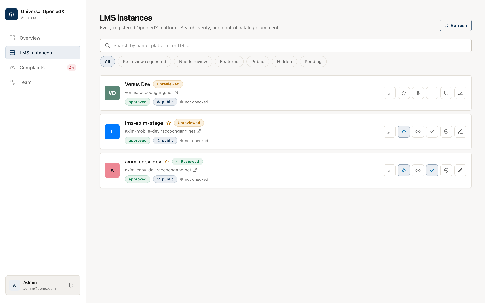
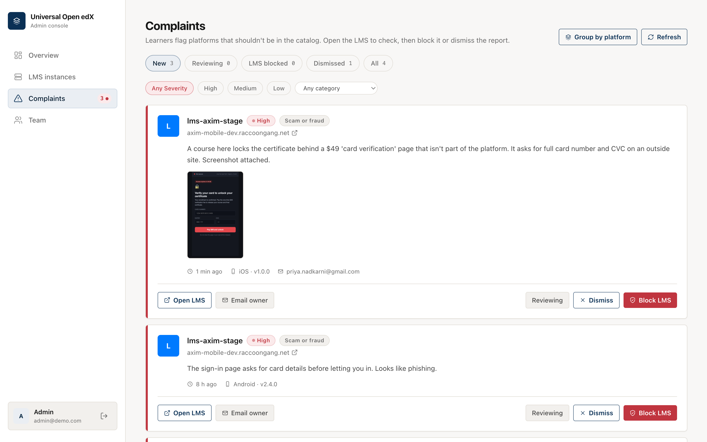
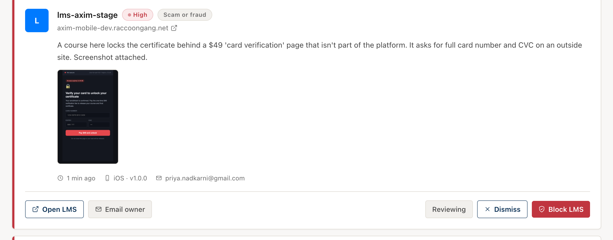
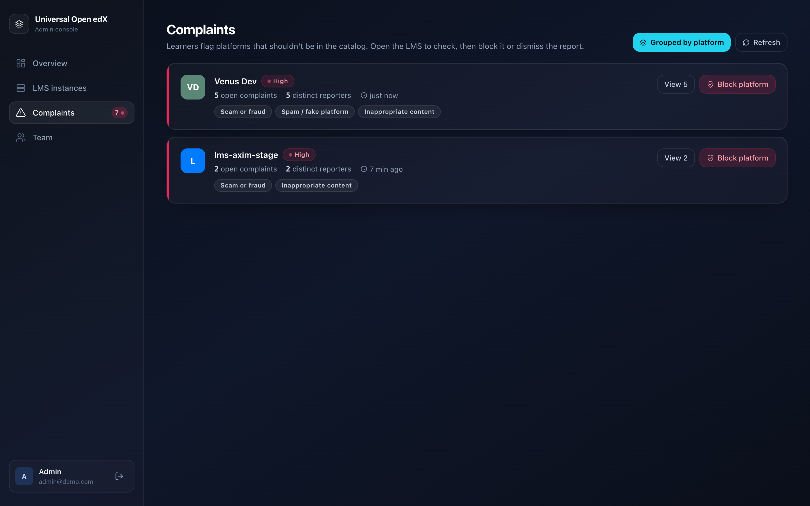
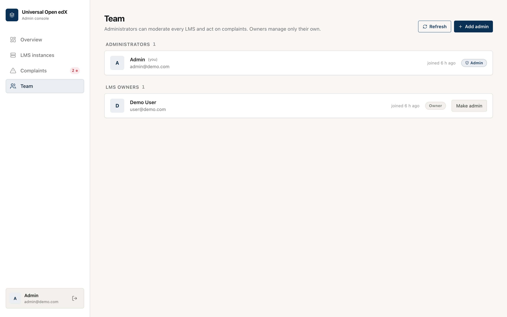

# Admin console

Administrators moderate the whole catalog here: review new platforms, act on
learner complaints, and manage the team. Sign in at `/dashboard` with an admin
account.

## Overview

The landing page shows what needs attention: open complaints (with how many are
high-severity), how many platforms are awaiting your review, catalog totals, and
the latest complaints and review queue.

<figure markdown>
  
  <figcaption>The overview dashboard</figcaption>
</figure>

The **Complaints** item in the sidebar carries a live badge; it turns red and a
toast appears the moment a high-severity complaint arrives, even if you're on
another screen.

## LMS instances

Every registered platform, built to stay usable at hundreds of entries.

<figure markdown>
  
  <figcaption>Search, filter, and per-row controls</figcaption>
</figure>

- **Search** by name, platform, or URL; **filter** by needs-review, re-review
  requested, featured, public/hidden, or pending.
- Per platform you can: **recheck health** (is it online?), **feature** it (for
  curated mode), toggle **public/hidden**, mark **reviewed**, **block/restore**,
  and **edit** it in the wizard.
- Status pills show approved / pending / **blocked**, plus health and review state.

## Complaints (triage inbox)

Learner reports land here, **high-severity first**. Each card shows the platform,
the category, the learner's message, an optional screenshot, and where it came
from (iOS/Android, app version).

<figure markdown>
  
  <figcaption>The triage inbox, severity-sorted</figcaption>
</figure>

For each complaint you can:

- **Open LMS** — visit the platform to see the reported content yourself.
- **Block LMS** — remove it from the catalog (the app stops showing it). Reversible
  from *LMS instances*.
- **Dismiss** — the report isn't valid; keep the platform.
- **Email owner** — send (or open a pre-filled draft of) a notice explaining the
  reason and that access is restored once fixed.

Filter by **status**, **severity**, and **category**, and page through with
*Load more*.

### Screenshots as evidence

If the learner attached a screenshot, it shows right on the card — so you can judge
without leaving the console.

<figure markdown>
  
  <figcaption>Reporter's screenshot, inline</figcaption>
</figure>

### Group by platform (spotting brigading)

Switch to **Group by platform** to see one row per reported platform with the
number of complaints **and the number of distinct reporters**. This is how you
tell a real problem (many different people) from a coordinated pile-on (one person,
many reports). Block or drill into a platform straight from the group.

<figure markdown>
  
  <figcaption>Per-platform view with distinct-reporter counts</figcaption>
</figure>

!!! warning "No automatic takedown"
    Complaints never hide or block a platform on their own — that would let a spam
    campaign knock out a legitimate platform. A person always makes the call. Rate
    limiting keeps the report flow itself from being flooded.

### The audit trail

Every block, unblock, dismiss, review, owner-notification, and re-review request is
recorded (who, what, when) and kept even after an unblock, so there's always a
history of how a platform was handled.

## Team

Administrators can moderate everything; owners manage only their own platforms. Any
admin can add another admin or change a user's role.

<figure markdown>
  
  <figcaption>Administrators and LMS owners</figcaption>
</figure>
