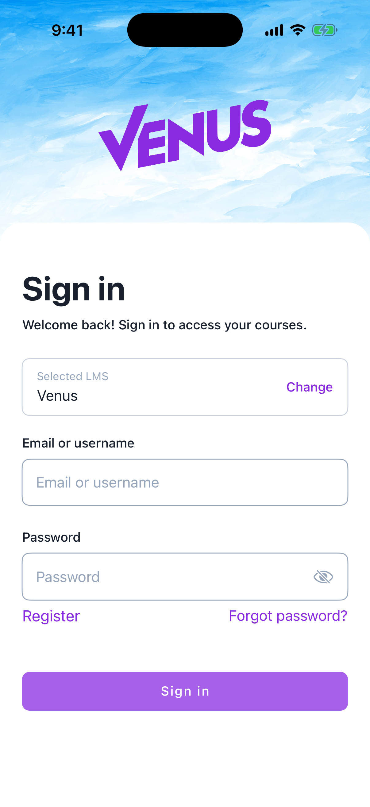
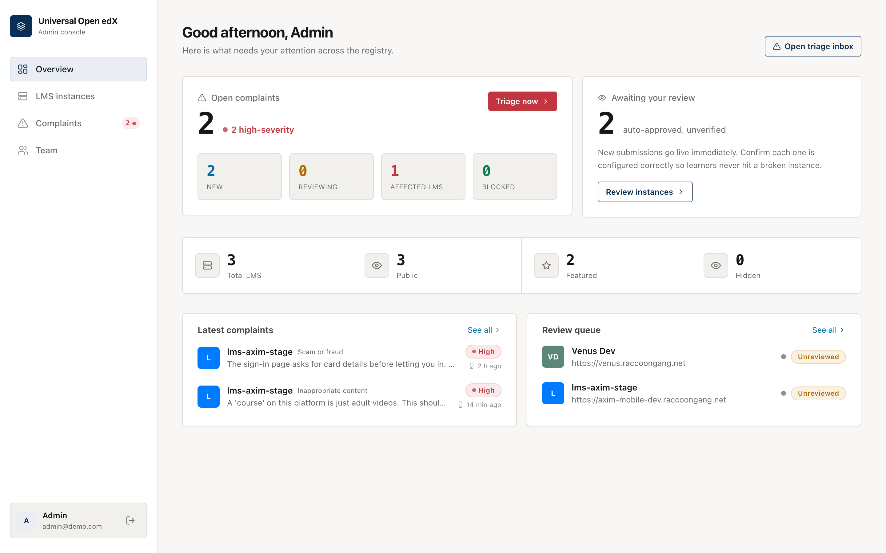

# Open X Project

One mobile app that works with any Open edX platform, plus the registry and admin
console behind it.

Instead of every Open edX platform shipping its own app, a learner installs **one**
app, finds their platform in a catalog, and signs in. Platform owners put their
instance in that catalog by filling out a short wizard. Administrators keep the
catalog safe and act on what learners report from the app.

<figure markdown>
  { width="290" }
  <figcaption>The same binary, themed for whichever platform the learner picked</figcaption>
</figure>

!!! note "Pilot status"
    Open edX has approved this as a pilot. It runs independently and **not** under
    the Open edX name. If the pilot goes well, Open edX decides whether to run it
    officially. The iOS and Android apps live in separate repositories that will
    move to the official Open edX repos at that point.

    Live registry: **[openedx-lms.stepanok.com](https://openedx-lms.stepanok.com)**

## Who this is for

-   :material-cellphone: **Learners**

    Install the app, find your platform, sign in, and report anything that looks
    wrong. → [For learners](learners.md)

-   :material-school: **LMS owners**

    Register your Open edX instance so it appears in the app, and manage how it
    looks. → [Register your LMS](registering-an-lms.md)

-   :material-shield-account: **Administrators**

    Review new platforms, triage learner complaints, and block bad actors. →
    [Admin console](admin-console.md)

-   :material-domain: **Providers**

    Run one branded app across several of your own platforms. →
    [Provider mode](provider-mode.md)

## The short version

1. An owner registers their Open edX platform through the **wizard**. It goes live
   in the catalog right away; an admin confirms it afterward.
2. A learner opens the app, **finds the platform**, and signs in with their normal
   Open edX account. The app themes itself to match the platform.
3. If something is wrong (adult content, a scam, impersonation), the learner
   **reports the platform** from the app's Profile tab while signed in.
4. The report lands in the admin **triage inbox** within seconds. An admin opens
   the platform to check, then **blocks it** (removed from the app) or dismisses
   the report, and emails the owner.
5. The owner sees the block and the reason in their own workspace, fixes the
   issue, and requests a re-review.

<figure markdown>
  
  <figcaption>The admin console: complaints, review queue, and catalog totals at a glance</figcaption>
</figure>

See [How it works](how-it-works.md) for the full picture.
