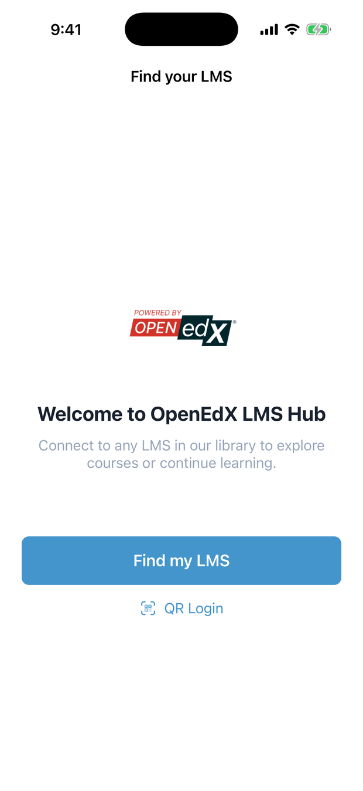
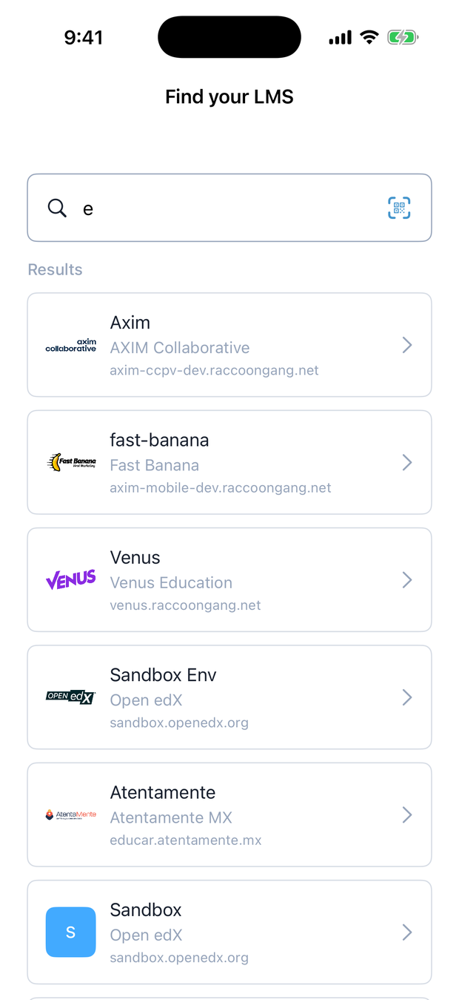
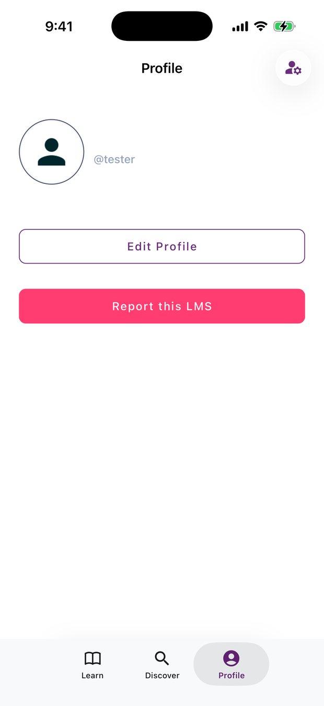
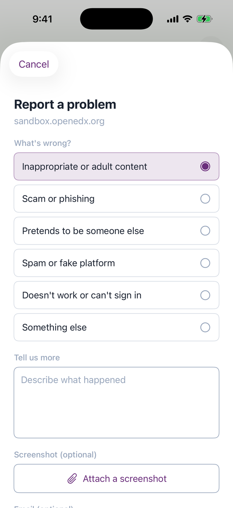

# For learners — the mobile app

The app works like any Open edX mobile app, with one difference at the very start:
instead of being locked to a single platform, you choose which Open edX platform
to open. Everything after sign-in is the Open edX experience you already know.

<figure markdown>
  { width="300" }
  <figcaption>The first screen: pick a platform before you sign in</figcaption>
</figure>

## 1. Find your platform

Open the app and you land on **Find your LMS**.

- **Search** (the default): type your platform's name or web address. Matches from
  the catalog appear with their logo — tap one to select it.
- **Scan a QR code**: if your platform shows a sign-in QR code, use **QR Login** to
  jump straight to it.
- **Curated app**: if your school or company runs its own version of the app, there's
  no search — it opens straight onto their platforms as a list. See
  [Provider / curated mode](provider-mode.md).

<figure markdown>
  { width="300" }
  <figcaption>Live results from the catalog, each with its own logo and address</figcaption>
</figure>

Pick a platform and the app takes on its identity — logo, colours, sign-in
background — then drops you on that platform's sign-in screen.

<figure markdown>
  { width="300" }
  <figcaption>One app, themed for the platform you chose (here: Venus)</figcaption>
</figure>

## 2. Sign in and learn

Sign in with the account you already use on that platform. From here it's the
standard Open edX app: your dashboard, course content, videos, dates, and offline
downloads. Nothing about that part changes — the registry only decides which
platform you connected to.

Want to switch platforms later? Tap **Change** on the sign-in screen to go back to
the catalog.

## 3. Report a problem with a platform

Anyone can add a platform to the catalog, so once in a while you might hit one that
doesn't belong. While you're signed into it, open the **Profile** tab and tap
**Report this LMS**.

<figure markdown>
  { width="300" }
  <figcaption>Report the platform you're signed into, from the Profile tab</figcaption>
</figure>

Pick what's wrong, add a short note, and optionally attach a screenshot:

| Reason | Use it when… |
|--------|--------------|
| Inappropriate or adult content | The platform hosts adult or harmful content |
| Scam or phishing | It asks for payment or credentials in a suspicious way |
| Pretends to be someone else | It impersonates a real institution |
| Spam or fake platform | It isn't a real learning platform |
| Doesn't work or can't sign in | It's broken or inaccessible |
| Something else | Anything not covered above |

<figure markdown>
  { width="300" }
  <figcaption>Attach a screenshot so a moderator sees exactly what you saw</figcaption>
</figure>

The app shrinks and compresses the screenshot before sending, so it uploads quickly
even on mobile data. Your email is optional.

!!! info "What happens next"
    Your report goes straight to the moderators. They open the platform, check it
    themselves, and decide whether to remove it. Reports never hide a platform
    automatically — a real person makes every call — so a pile of complaints can't
    be used to knock a legitimate platform offline.

## Getting the app

- **iOS** — TestFlight (pilot)
- **Android** — APK / Play (pilot)

Download links are on the [project landing page](https://openedx-lms.stepanok.com).
