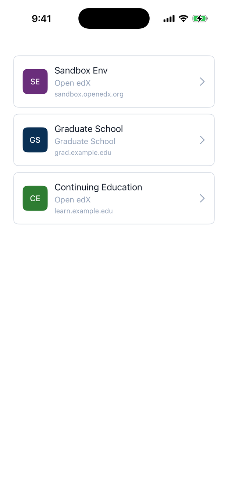
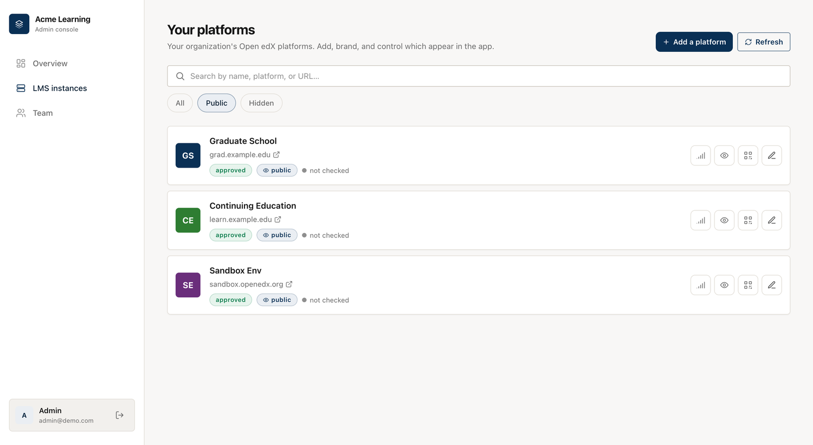
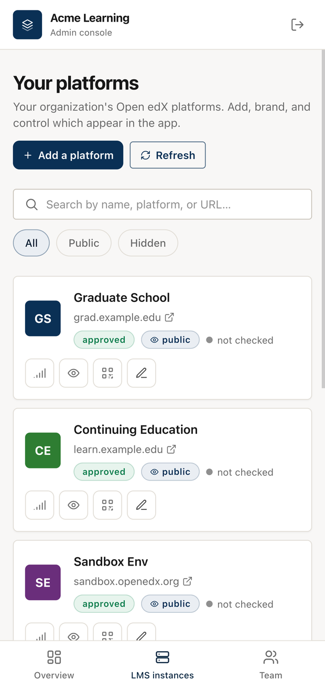

# Provider / curated mode

The pilot runs an open catalog: anyone can register an Open edX platform, learners
search for it, and moderators clean up what doesn't belong. That model assumes you
don't trust the list.

An institution that runs a handful of its own platforms has the opposite problem.
Say you're a university with three Open edX sites — one for undergraduates, one for
the graduate school, one for continuing education. You want a single branded app
where students pick their site and sign in. You don't want a search box, you don't
want strangers adding entries, and there's nothing to moderate because every
platform on the list is yours.

That's **curated mode** (`DIRECTORY_MODE=curated`). It turns the whole public
marketplace layer off and treats the registry as one organization's own catalog.

<figure markdown>
  { width="300" }
  <figcaption>No search, no landing screen — the app opens on your platforms and a
  student taps one to sign in</figcaption>
</figure>

## What changes

Everything that exists to police an untrusted list goes away.

- **No moderation.** A platform you add is live and marked reviewed the moment you
  save it. There's no "pending" or "unreviewed" state, because you're not vetting
  submissions from strangers — you're listing your own sites.
- **No learner reports.** The app hides *Report this LMS*, and the report endpoint
  is closed. Nobody reports a platform they were handed by their own institution.
- **No public sign-up.** The account form only signs people in. You provision admins
  yourself (an environment variable at first boot, or the **Team** tab afterwards),
  and any admin can add a platform.
- **The app skips search.** Learners don't hunt for a platform. The app opens
  directly on your platforms, and tapping one themes the app to that site and drops
  the student on its sign-in screen.

Public visibility is the one control that still matters: a platform set to **public**
shows up in the app, and one set to **hidden** doesn't. That's how you stage a site
before students see it, or retire one without deleting its history.

## The console, trimmed to match

Because there's nothing to moderate, the admin console loses the parts that only
made sense for an open catalog. The **Complaints** tab is gone, the review queue and
the reviewed/featured badges disappear, and the LMS list keeps a single filter:
public or hidden.

<figure markdown>
  
  <figcaption>"Your platforms" — add one, brand it, and toggle whether it shows in
  the app. No triage inbox, no review backlog.</figcaption>
</figure>

The console is responsive, so you can add or hide a platform from a phone as easily
as from a desktop.

<figure markdown>
  { width="300" }
  <figcaption>On a small screen the sidebar becomes a bottom tab bar</figcaption>
</figure>

## Curated vs. the open pilot

| | Search mode (pilot default) | Curated mode (provider) |
|---|---|---|
| Who fills the catalog | Anyone who registers | Only admins you provision |
| The learner's first screen | A search box | Your platforms, listed directly |
| New submissions | Auto-approved, then reviewed | Live and reviewed on save |
| Learner reports | Routed to a triage inbox | Off |
| Public sign-up | Open to LMS owners | Closed |
| What "in the app" means | Public + not blocked | Public (hidden = staged/retired) |
| Best fit | A shared, public app | One organization's branded app |

## Set it up

1. **Deploy your own registry.** Fork this repository and stand it up following
   [Configuration & deployment](deploying.md). A provider runs its own instance
   rather than sharing the public pilot.
2. **Switch the mode on.** Set `DIRECTORY_MODE=curated`, and set `PROVIDER_NAME` and
   `PROVIDER_TAGLINE` so the console and app carry your name.
3. **Provision the first admin.** Set `ADMIN_EMAIL` and `ADMIN_PASSWORD` before the
   first boot. After that, add teammates from the **Team** tab.
4. **Add your platforms.** In the console open **LMS instances → Add a platform** and
   run the wizard for each site: base URL, OAuth client, logo, colours, sign-in
   background. Each one goes live immediately. Keep a platform **hidden** until it's
   ready, and use its `sort_order` to set where it sits in the list.
5. **Point your app at the registry.**
    - **iOS** — set `LMS_DIRECTORY.DIRECTORY_URL` in your config. The app follows the
      server's mode, so it switches to curated on its own.
    - **Android** — set `LMS_DIRECTORY.DIRECTORY_URL` in `rg_config.json`. The app
      treats the list as curated when either the server or its own
      `DIRECTORY_MODE` says so.

Flip `DIRECTORY_MODE` back to `search` and the same registry reopens as a public
catalog, moderation and all.

## Example `provider_config.json`

Drop this at the repository root. Environment variables override anything set here.

```json
{
  "directory_mode": "curated",
  "provider_name": "Acme Learning",
  "provider_tagline": "All of Acme's academies in one app",
  "webhook_url": "https://hooks.slack.com/services/…"
}
```
