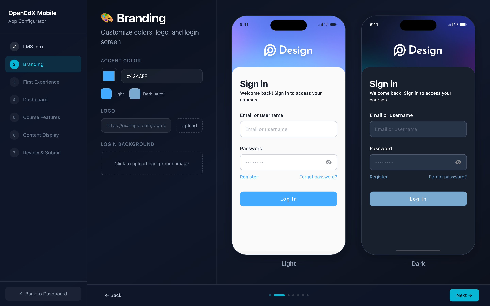
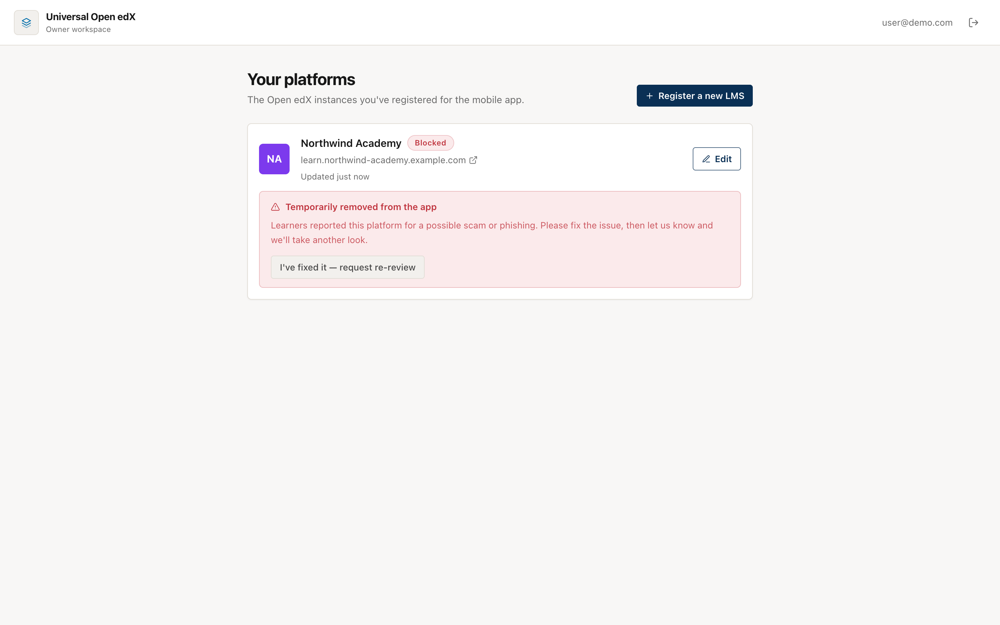

# Register your LMS (for owners)

If you run an Open edX platform, register it here so learners can find it in the
app. It takes a few minutes.

## What you need first

- Your platform's URL (for example `https://learn.example.com`).
- A **mobile OAuth client ID** on your Open edX instance.

!!! tip "Creating the OAuth client"
    In your Open edX admin, go to **Django OAuth Toolkit → Applications** and
    create a *public* client with the *Resource owner password-based* grant type.
    Enable **Mobile course available** on the courses you want in the app. The
    wizard links to the full guide.

## 1. Create an account and open the wizard

Sign in at the registry ([openedx-lms.stepanok.com](https://openedx-lms.stepanok.com))
and choose **Register a new LMS**. The wizard walks you through it.

<figure markdown>
  
  <figcaption>The registration wizard verifies your platform as you go</figcaption>
</figure>

## 2. Fill in the wizard

| Step | What you set |
|------|--------------|
| **LMS info** | Name, platform name, URL, OAuth client ID, description, support email |
| **Branding** | Accent color and logo — the app themes itself to these |
| **First experience** | Whether learners can browse courses before signing in |
| **Dashboard** | Gallery or list layout |
| **Course features** | Progress, navigation and other per-course toggles |
| **Content display** | How unsupported units are handled |
| **Review & submit** | Confirm everything and register |

The **Branding** step previews your app live, in both light and dark mode, as you
change the accent colour and logo — so you see exactly what learners will get.

<figure markdown>
  
  <figcaption>Set your colour and logo; the phone preview updates as you type</figcaption>
</figure>

On the first step the wizard checks, live, that your URL is reachable and that the
OAuth client exists — so you catch mistakes before submitting.

## 3. It goes live, then gets reviewed

New platforms are **approved automatically**, so yours appears in the app catalog
right away. It's marked *awaiting review* until an administrator confirms it's set
up correctly. You don't need to do anything for that step.

## Your workspace

Signing in as an owner shows **your platforms**: their status, and a link to edit
each one in the wizard.

- **Live** — in the catalog and reviewed.
- **Live · awaiting review** — in the catalog, an admin hasn't confirmed it yet.
- **Blocked** — removed from the app after complaints (see below).

## If your platform is blocked

If learners report your platform and an administrator decides it shouldn't be in
the app, it's **temporarily removed** and you'll see why in your workspace (and by
email).

<figure markdown>
  
  <figcaption>The block reason shown to the owner, with a re-review button</figcaption>
</figure>

Fix the issue, then click **“I've fixed it — request re-review.”** That flags your
platform for an administrator to look again and restore it.
